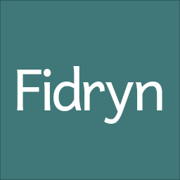

# Fidryn Software Logo 0.0.1

- Foreground color: `#ffffff` (white)
- Background color: `#336666`
- Typeface: [Andika 6.200](https://software.sil.org/andika/andika-release-6-200/)
  - Parameters used in `logo.tif` (1024x1024):
    - Weight: Regular
    - Size: 323 pt
    - Kerning has been modified.

## License

 
<a property="dct:title" rel="cc:attributionURL" href="https://github.com/Fidryn-Software/logo">Fidryn Software Logo 0.0.1</a> is marked with <a href="http://creativecommons.org/publicdomain/zero/1.0?ref=chooser-v1" target="_blank" rel="license noopener noreferrer" style="display:inline-block;">CC0 1.0

